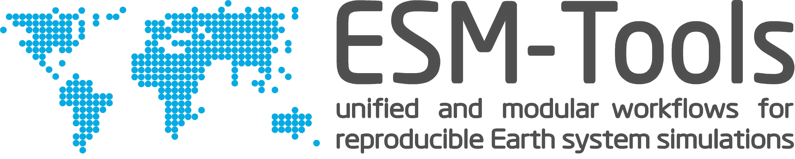

---
# Feel free to add content and custom Front Matter to this file.
# To modify the layout, see https://jekyllrb.com/docs/themes/#overriding-theme-defaults

layout: default
permalink: /
---
# 

# Welcome to ESM-Tools!

ESM-Tools is a modular infrastructure software that allows for seamlessly building and configuration of Earth System Models (ESM) across different High Performance Computing (HPC) platforms. 

The ESM-Tools software is developed at the <a href="https://awi.de" target="_blank">Alfred Wegener Institute for Polar and Marine Research</a> in Bremerhaven, jointly with the <a href="https://www.geomar.de/" target="_blank">GEOMAR Helmholtz-Zentrum für Ozeanforschung</a> in Kiel. The software is open-source and distributed through <a href="https://github.com/esm-tools/esm_tools" target="_blank">GitHub</a>. Its design follows the separation of concerns principle. It consists of an HPC- and model-agnostic Python back-end and is complemented by modular easy-to-read/write YAML files defining the configuration of each specific component of the system (HPC- and model-configurations).
This allows for a sustainable usage as well as development of the ESM-Tools software. 

ESM-Tools therefore supports sustainable research with Earth System Models and contributes to reproducible research results.

<!--- (DKRZ-Levante, Jülich-Juwels, HLRN-4’s Lise and Emmy, ECMWF-Atos, ICCP-Aleph, etc.). -->

<!--- We currently provide support for AWI's own modelling infrastructure, which encompasses the FESOM Ocean Model, the OpenIFS and ECHAM Atmosphere model, the JSBACH and (coming soon) the LPJ-Guess land vegetation models, the PISM ice sheet model, and the VILMA solid earth model. -->

# How to get started
If you are interested in using the ESM-Tools software, please have a look at our documentation  <a href="https://esm-tools.readthedocs.io" target="_blank">https://esm-tools.readthedocs.io</a>  and the information provided in the ESM-Tools Github repository <a href="https://github.com/esm-tools/esm_tools#esm-tools" target="_blank">https://github.com/esm-tools/esm_tools#esm-tools</a>. For further information on the software and training materials please find the information provided [here](/about/).

If you would like to give feedback or report any issue related to the ESM-Tools code, please have a look at our Github <a href="https://github.com/esm-tools/esm_tools/discussions" target="_blank">Discussions</a> and <a href="https://github.com/esm-tools/esm_tools/issues" target="_blank">Issues</a> page. If you  would like to contribute to the code development, please see the information on <a href="https://github.com/esm-tools/esm_tools/blob/release/CONTRIBUTING.rst#contributing" target="_blank">how to contribute</a>.

If you have any further questions please [contact us](/contact/).
